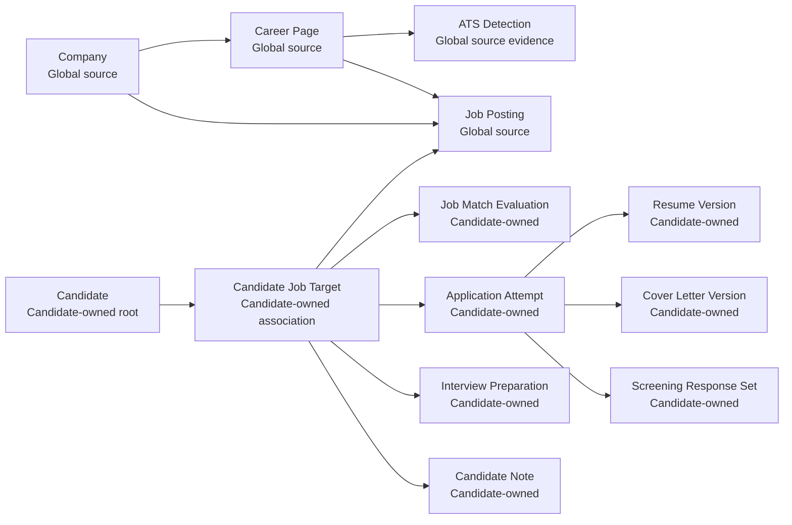
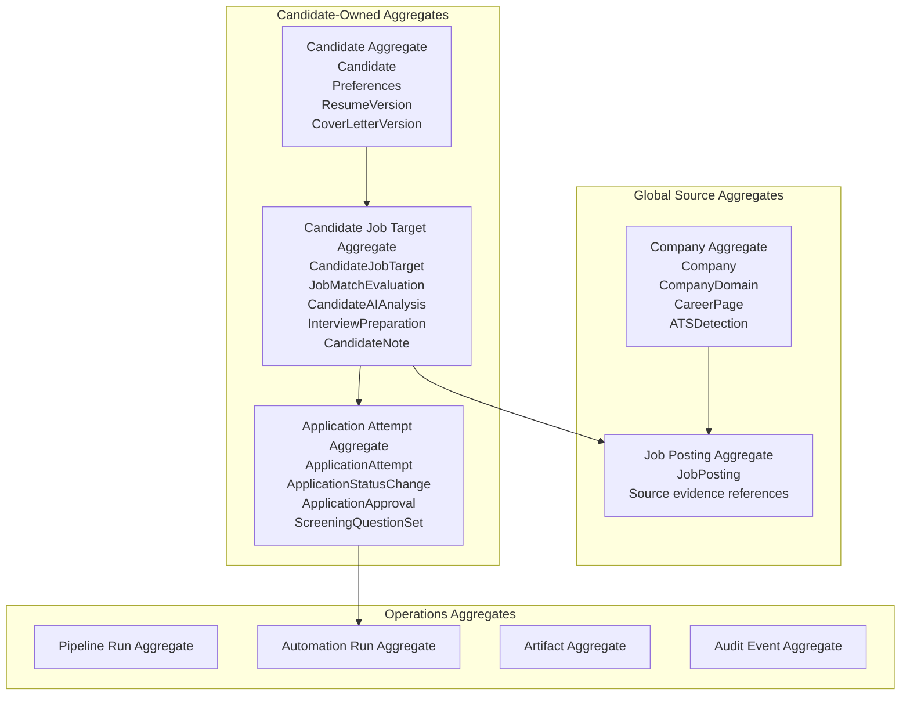
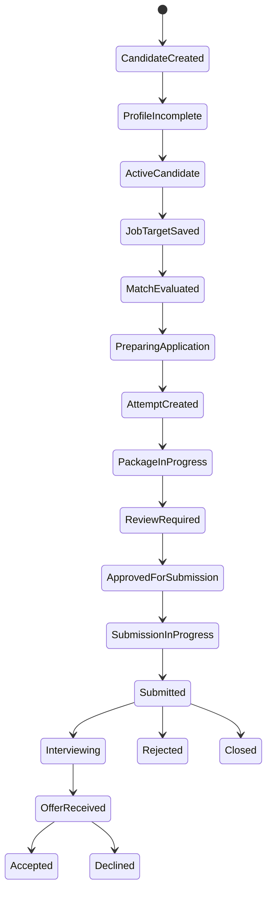
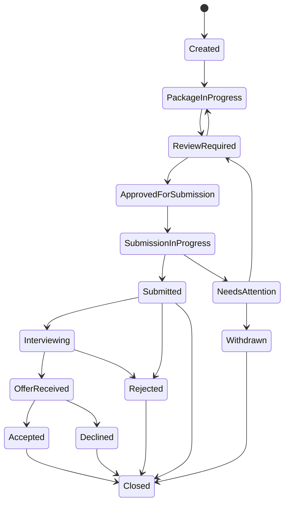
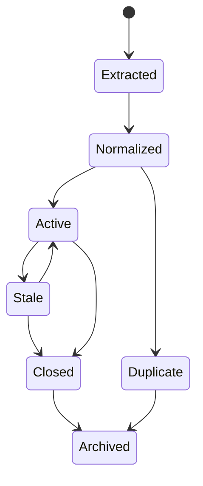

# JobPilot AI Domain Model

## Purpose

This document defines the JobPilot AI domain model in business terms. It intentionally avoids implementation code, SQLAlchemy models, FastAPI routes, database schemas, and persistence mechanics.

JobPilot AI helps a candidate discover jobs, evaluate fit, prepare application materials, submit applications with review controls, track outcomes, and prepare for interviews.

## Architectural Decisions

- The MVP is single-user and local-first, but the model must allow later multi-user support without replacing core concepts.
- Companies and jobs are global source entities.
- Candidate-specific information must not be stored on `Company` or `JobPosting`.
- A candidate may create multiple application attempts for the same job.
- Previous application attempts are never overwritten.
- The MVP requires explicit human approval before final submission.
- The domain must allow submission policy to change later without changing the core entity model.
- AI outputs are candidate-owned when they evaluate, prepare, rank, explain, or recommend actions for a specific candidate.

## Ubiquitous Language

- **Global source entity**: A fact discovered from the outside world and shared across candidates, such as a company or job.
- **Candidate-owned entity**: Data created by or for a candidate, such as preferences, matches, application attempts, notes, and interview prep.
- **Candidate job target**: The candidate-specific relationship between a candidate and a global job.
- **Application attempt**: One independent attempt to apply to a job, with its own package, status history, notes, and audit trail.
- **Application package**: The resume, cover letter, screening answers, and other reviewed material selected for an application attempt.
- **Submission policy**: Business policy that decides whether an application attempt may be submitted.
- **Human approval**: Explicit candidate approval that authorizes final submission for the current attempt.
- **Artifact**: Generated or captured material, such as resume files, screenshots, AI outputs, extracted payloads, and interview prep documents.

## High-Level Domain Map

## Ownership Boundaries

### Global Source Boundary

Owns shared source facts:

- Companies.
- Company domains.
- Career pages.
- ATS detections.
- Job postings.
- Raw source captures and extraction evidence.

Rules:

- Global source entities do not contain candidate-specific status, notes, scoring, recommendations, applications, resumes, or interview material.
- Global source entities may be corrected or superseded as source facts change, but candidate history must continue to reference the source entity version or source snapshot used at the time.
- Global jobs can be referenced by multiple candidates.

### Candidate Boundary

Owns candidate-specific state:

- Candidate profile.
- Preferences.
- Resume versions.
- Cover letter versions.
- Candidate job targets.
- Match evaluations.
- AI analyses.
- Application attempts.
- Screening responses.
- Notes.
- Interview preparation.
- Activity history.

Rules:

- Candidate-owned entities may reference global companies and jobs.
- Candidate-owned decisions and generated content belong to the candidate that requested or approved them.
- Candidate-owned history is append-oriented where auditability matters.

### Operations Boundary

Owns durable execution records:

- Pipeline runs.
- Automation runs.
- Provider interaction records.
- Artifacts.
- Audit events.

Rules:

- Operations records describe work performed by the system.
- Operations records may reference either global source entities or candidate-owned entities.
- Operations records do not own business decisions; they provide traceability.

## Core Entities

### Company

Purpose:

Represents a real organization that may publish jobs.

Responsibilities:

- Maintain canonical company identity.
- Group known domains, career pages, ATS detections, and jobs.
- Provide the global source anchor for jobs.

Attributes:

- `company_id`
- `canonical_name`
- `display_name`
- `description`
- `primary_domain`
- `status`
- `source_confidence`
- `first_seen_at`
- `last_verified_at`
- `created_at`
- `updated_at`

Invariants:

- A company must have a stable identity.
- A company must not store candidate-specific data.
- A company name or domain must be sufficient to support identity resolution.
- Duplicate companies should be resolved through company identity policy, not by creating candidate-specific copies.

Relationships:

- Owns many `CompanyDomain` entities.
- Owns many `CareerPage` entities.
- Owns many `ATSDetection` records through career pages or company-level evidence.
- Owns many `JobPosting` entities.
- Referenced by candidate-owned entities indirectly through jobs or explicitly for notes and interview prep where needed.

Lifecycle:

- `discovered`: Found from search, import, or user input.
- `registered`: Accepted as a known company.
- `verified`: Identity and domain have sufficient confidence.
- `active`: Eligible for scanning and job extraction.
- `inactive`: No longer scanned by default.
- `merged`: Superseded by another company identity.
- `archived`: Retained for history but hidden from normal workflows.

### CompanyDomain

Purpose:

Represents a domain, subdomain, or alias associated with a company.

Responsibilities:

- Identify company-owned web properties.
- Distinguish primary domains, aliases, career subdomains, and third-party hosted domains.
- Support company identity resolution and career page discovery.

Attributes:

- `company_domain_id`
- `company_id`
- `domain`
- `domain_type`
- `verification_status`
- `source`
- `confidence`
- `first_seen_at`
- `last_verified_at`

Invariants:

- A domain belongs to exactly one canonical company at a time.
- Domain confidence must be explicit when discovered automatically.
- Candidate-specific preferences must not be attached to domains.

Relationships:

- Belongs to one `Company`.
- May lead to many `CareerPage` discoveries.

Lifecycle:

- `candidate`: Suggested but not trusted.
- `verified`: Accepted as belonging to the company.
- `rejected`: Determined not to belong.
- `stale`: Not recently verified.
- `retired`: Historical association only.

### CareerPage

Purpose:

Represents a page or entry point where a company lists jobs.

Responsibilities:

- Hold career page URL and discovery evidence.
- Track page type and reachability.
- Anchor ATS detection and job extraction.

Attributes:

- `career_page_id`
- `company_id`
- `url`
- `page_type`
- `discovery_source`
- `confidence`
- `reachability_status`
- `last_scanned_at`
- `last_successful_scan_at`
- `created_at`
- `updated_at`

Invariants:

- A career page belongs to one company.
- A career page URL must be normalized.
- A career page must not contain candidate-specific workflow state.

Relationships:

- Belongs to one `Company`.
- May have many `ATSDetection` records.
- May source many `JobPosting` records.
- May be referenced by `PipelineRun` and `Artifact`.

Lifecycle:

- `discovered`: Found but not validated.
- `reachable`: Page can be accessed.
- `detected`: ATS or extraction strategy is known.
- `extractable`: Jobs can be extracted.
- `unreachable`: Currently unavailable.
- `retired`: No longer a valid career source.

### ATSDetection

Purpose:

Represents evidence that a career page or company uses a specific applicant tracking system.

Responsibilities:

- Capture ATS type, confidence, and detection evidence.
- Indicate plugin capabilities available for extraction and automation.
- Support selection of ATS-specific workflows.

Attributes:

- `ats_detection_id`
- `company_id`
- `career_page_id`
- `ats_type`
- `plugin_name`
- `plugin_version`
- `confidence`
- `evidence`
- `capabilities`
- `detected_at`
- `valid_until`

Invariants:

- Detection evidence must be retained or referenced.
- A low-confidence detection must not be treated as authoritative.
- ATS detection must not decide candidate application status.

Relationships:

- Belongs to a `Company`.
- Usually belongs to a `CareerPage`.
- Referenced by job extraction and automation runs.

Lifecycle:

- `proposed`: Detection evidence exists but confidence is low.
- `confirmed`: Detection is trusted for extraction.
- `superseded`: Replaced by newer evidence.
- `expired`: Detection should be refreshed.
- `rejected`: Evidence was invalid.

### JobPosting

Purpose:

Represents a global employment opportunity published by a company.

Responsibilities:

- Preserve source identity and normalized job facts.
- Track freshness and publication status.
- Provide a shared job reference for candidate-specific targeting.

Attributes:

- `job_id`
- `company_id`
- `career_page_id`
- `source_url`
- `application_url`
- `external_job_id`
- `title`
- `department`
- `location`
- `remote_policy`
- `employment_type`
- `seniority`
- `description`
- `responsibilities`
- `requirements`
- `skills`
- `compensation`
- `benefits`
- `source_hash`
- `content_version`
- `source_status`
- `first_seen_at`
- `last_seen_at`
- `closed_at`

Invariants:

- A job posting must belong to a company.
- A job posting must preserve a link or reference to its source evidence.
- A job posting must not store candidate-specific match scores, notes, application status, resume selections, or AI recommendations.
- A job posting identity must be stable across refreshes when source evidence supports it.
- Changes to source content must produce a new content version or equivalent version marker.

Relationships:

- Belongs to one `Company`.
- May originate from one `CareerPage`.
- May be referenced by many `CandidateJobTarget` entities.
- May be referenced by source `Artifact` records.

Lifecycle:

- `extracted`: Raw job discovered.
- `normalized`: Core job facts available.
- `active`: Believed open.
- `stale`: Not seen in a recent scan.
- `closed`: Believed closed.
- `duplicate`: Resolved to another canonical job.
- `archived`: Retained for historical references.

### Candidate

Purpose:

Represents the person using JobPilot AI to search for and apply to jobs.

Responsibilities:

- Own profile facts and job search preferences.
- Own candidate-specific job relationships.
- Own resumes, cover letters, applications, notes, activity, and generated candidate-specific outputs.

Attributes:

- `candidate_id`
- `display_name`
- `contact_profile`
- `location`
- `work_authorization`
- `target_roles`
- `skills`
- `experience_summary`
- `education`
- `preferences`
- `privacy_settings`
- `profile_version`
- `status`
- `created_at`
- `updated_at`

Invariants:

- A candidate must have a stable identity.
- Candidate profile changes must be versioned when they affect matching, resume tailoring, screening, or interview prep.
- Sensitive candidate data must be classified and protected.
- Candidate-owned data must not be copied into global source entities.

Relationships:

- Owns many `ResumeVersion` entities.
- Owns many `CoverLetterVersion` entities.
- Owns many `CandidateJobTarget` entities.
- Owns many `CandidateNote` records.
- Owns many `CandidateActivity` records.
- May later belong to a `UserAccount` or tenant boundary without changing candidate-owned entity semantics.

Lifecycle:

- `created`: Candidate identity exists.
- `profile_incomplete`: Missing information needed for core workflows.
- `active`: Eligible for matching and application workflows.
- `paused`: Candidate workflows are suspended.
- `archived`: Retained for history.
- `deleted_requested`: Deletion/export policy has been invoked.

### CandidateJobTarget

Purpose:

Represents a candidate-specific relationship to a global job.

Responsibilities:

- Hold candidate-specific status, interest, fit, notes, and preparation around a job.
- Group matches, analyses, application attempts, interview prep, and activity for one candidate-job relationship.
- Preserve separation between global job facts and candidate-specific decisions.

Attributes:

- `candidate_job_target_id`
- `candidate_id`
- `job_id`
- `interest_status`
- `target_status`
- `priority`
- `source`
- `candidate_notes_summary`
- `latest_match_evaluation_id`
- `latest_application_attempt_id`
- `created_at`
- `updated_at`

Invariants:

- A candidate job target references exactly one candidate and one global job.
- Candidate-specific status must live here or in child entities, never on `JobPosting`.
- A candidate may have at most one active candidate job target for a given job unless the business explicitly introduces separate targeting contexts.
- Closing or archiving a target must not delete application attempts.

Relationships:

- Belongs to one `Candidate`.
- References one `JobPosting`.
- Owns many `JobMatchEvaluation` records.
- Owns many `ApplicationAttempt` records.
- Owns many `CandidateAIAnalysis` records.
- Owns many `InterviewPreparation` records.
- Owns many `CandidateNote` records scoped to the job.

Lifecycle:

- `saved`: Candidate has saved or imported the job.
- `evaluating`: Matching or review is in progress.
- `interested`: Candidate may apply.
- `not_interested`: Candidate declined the job.
- `preparing`: Application materials are being created.
- `applied`: At least one attempt has been submitted.
- `interviewing`: Candidate is in interview process.
- `closed`: Candidate is no longer pursuing this job.
- `archived`: Hidden from active workflows but retained.

### JobMatchEvaluation

Purpose:

Represents a candidate-specific evaluation of fit for a global job.

Responsibilities:

- Store score, recommendation, strengths, gaps, and reasoning.
- Record candidate profile version and job content version used.
- Support recalculation without overwriting previous evaluations.

Attributes:

- `match_evaluation_id`
- `candidate_job_target_id`
- `candidate_id`
- `job_id`
- `candidate_profile_version`
- `job_content_version`
- `strategy`
- `score`
- `recommendation`
- `criteria_breakdown`
- `strengths`
- `gaps`
- `risks`
- `explanation`
- `confidence`
- `provider_metadata`
- `created_at`

Invariants:

- A match evaluation belongs to a candidate job target.
- A match evaluation is immutable once accepted as history.
- AI-generated reasoning must include generation metadata.
- Score meaning must be tied to a named strategy or scoring policy.

Relationships:

- Belongs to one `CandidateJobTarget`.
- References one `Candidate`.
- References one `JobPosting`.
- May reference `CandidateAIAnalysis` or provider interaction records.

Lifecycle:

- `requested`: Evaluation has been asked for.
- `generated`: Evaluation output exists.
- `validated`: Output passed domain checks.
- `superseded`: A newer evaluation exists.
- `rejected`: Output failed validation or review.

### CandidateAIAnalysis

Purpose:

Represents AI-generated candidate-specific analysis that is not itself a resume, answer, or interview artifact.

Responsibilities:

- Store qualitative analysis, recommendations, risks, and explanations.
- Make provider provenance visible.
- Keep AI outputs separate from global jobs and companies.

Attributes:

- `analysis_id`
- `candidate_id`
- `candidate_job_target_id`
- `analysis_type`
- `input_references`
- `output_summary`
- `structured_output`
- `confidence`
- `provider_metadata`
- `prompt_version`
- `created_at`

Invariants:

- AI analysis must belong to a candidate.
- AI analysis must reference the source context used to generate it.
- AI analysis must be treated as untrusted until validated or reviewed.

Relationships:

- Belongs to one `Candidate`.
- May belong to one `CandidateJobTarget`.
- May support match evaluation, resume tailoring, screening, or interview preparation.

Lifecycle:

- `drafted`: Generated but not reviewed.
- `validated`: Passed automated checks.
- `reviewed`: Candidate accepted or acknowledged it.
- `superseded`: Replaced by a newer analysis.
- `discarded`: Not used.

### ResumeVersion

Purpose:

Represents an original, parsed, imported, or tailored resume owned by a candidate.

Responsibilities:

- Preserve resume content and metadata.
- Track derivation from source resumes.
- Support selection in application attempts.

Attributes:

- `resume_version_id`
- `candidate_id`
- `source_resume_version_id`
- `target_job_id`
- `resume_type`
- `title`
- `content_reference`
- `parsed_facts`
- `tailoring_rationale`
- `review_status`
- `generation_metadata`
- `created_at`

Invariants:

- A resume version belongs to one candidate.
- A tailored resume must reference a target job and source resume when applicable.
- A resume selected for submission must be reviewed under the active submission policy.
- Resume history must not be overwritten by later tailoring.

Relationships:

- Belongs to one `Candidate`.
- May derive from another `ResumeVersion`.
- May target one `JobPosting`.
- May be selected by many `ApplicationAttempt` records.
- May be represented by one or more `Artifact` records.

Lifecycle:

- `uploaded`: Candidate provided a source resume.
- `parsed`: Structured facts extracted.
- `drafted`: Generated or edited version exists.
- `review_required`: Needs candidate review before use.
- `approved`: Candidate approved for use.
- `retired`: No longer used for new attempts.
- `archived`: Retained for history.

### CoverLetterVersion

Purpose:

Represents a candidate-owned cover letter version for a job or general use.

Responsibilities:

- Store cover letter content and generation rationale.
- Track review and approval.
- Support selection in an application attempt.

Attributes:

- `cover_letter_version_id`
- `candidate_id`
- `candidate_job_target_id`
- `target_job_id`
- `title`
- `content_reference`
- `generation_metadata`
- `review_status`
- `created_at`

Invariants:

- A cover letter version belongs to one candidate.
- A job-specific cover letter must reference the target job or candidate job target.
- A cover letter selected for submission must satisfy review requirements.

Relationships:

- Belongs to one `Candidate`.
- May belong to one `CandidateJobTarget`.
- May be selected by many `ApplicationAttempt` records.
- May be represented by an `Artifact`.

Lifecycle:

- `drafted`
- `review_required`
- `approved`
- `retired`
- `archived`

### ScreeningQuestionSet

Purpose:

Represents screening questions discovered or entered for a candidate's application context.

Responsibilities:

- Capture questions and their source.
- Group candidate-specific answer drafts.
- Track review readiness.

Attributes:

- `screening_question_set_id`
- `candidate_job_target_id`
- `application_attempt_id`
- `source`
- `questions`
- `detected_at`
- `review_status`

Invariants:

- Screening questions used for an application attempt must be attached to candidate-owned context.
- Questions discovered from a job source are not answers and do not imply candidate approval.
- Screening content must not be stored on the global job as candidate-specific state.

Relationships:

- Belongs to one `CandidateJobTarget`.
- May belong to one `ApplicationAttempt`.
- Owns many `ScreeningAnswer` value objects or child entities.

Lifecycle:

- `detected`: Questions discovered from source or automation.
- `drafting_answers`: Answer generation or manual entry in progress.
- `review_required`: Candidate review needed.
- `approved`: Candidate approved answers for a specific attempt.
- `superseded`: Replaced by another set.

### ApplicationAttempt

Purpose:

Represents one independent attempt by a candidate to apply for a global job.

Responsibilities:

- Preserve a complete attempt-specific package.
- Track statuses, timestamps, notes, approvals, and audit trail.
- Support multiple attempts for the same candidate and job without overwriting history.

Attributes:

- `application_attempt_id`
- `candidate_job_target_id`
- `candidate_id`
- `job_id`
- `attempt_number`
- `submission_channel`
- `submission_policy`
- `status`
- `status_reason`
- `selected_resume_version_id`
- `selected_cover_letter_version_id`
- `screening_question_set_id`
- `approval_record`
- `submission_evidence`
- `external_confirmation`
- `started_at`
- `submitted_at`
- `closed_at`
- `created_at`
- `updated_at`

Invariants:

- An application attempt belongs to exactly one candidate job target.
- Each attempt has its own resume selection, cover letter selection, screening answers, status history, timestamps, notes, and audit trail.
- Previous attempts must never be overwritten by later attempts.
- Final submission requires the active submission policy to pass.
- For the MVP, final submission requires explicit human approval.
- An attempt must not be submitted without a complete and approved application package.

Relationships:

- Belongs to one `CandidateJobTarget`.
- References one `JobPosting`.
- References one selected `ResumeVersion`.
- May reference one selected `CoverLetterVersion`.
- May own or reference one `ScreeningQuestionSet`.
- Owns many `ApplicationStatusChange` records.
- Owns many `ApplicationApproval` records.
- Owns many `AutomationRun` records.
- Owns many attempt-scoped `CandidateNote` records.
- May own many `Artifact` records.

Lifecycle:

- `created`: Attempt exists but package is incomplete.
- `package_in_progress`: Materials are being prepared.
- `review_required`: Candidate must review generated or selected materials.
- `approved_for_submission`: Active submission policy is satisfied.
- `submission_in_progress`: Manual or automated submission has started.
- `submitted`: Submission completed.
- `needs_attention`: Human intervention is required.
- `withdrawn`: Candidate stopped the attempt before final outcome.
- `rejected`: Employer rejection recorded.
- `interviewing`: Interview process started for this attempt.
- `offer_received`: Offer received.
- `accepted`: Offer accepted.
- `declined`: Candidate declined or abandoned after offer.
- `closed`: Attempt is no longer active.

### ApplicationStatusChange

Purpose:

Represents one status transition in an application attempt.

Responsibilities:

- Preserve attempt history.
- Record when, why, and by whom status changed.
- Support auditability and timeline views.

Attributes:

- `status_change_id`
- `application_attempt_id`
- `from_status`
- `to_status`
- `reason`
- `actor`
- `occurred_at`
- `evidence_reference`

Invariants:

- Status changes are append-only.
- A status change must follow application transition policy.
- A status change must belong to one application attempt.

Relationships:

- Belongs to one `ApplicationAttempt`.
- May reference `Artifact`, `AutomationRun`, or `AuditEvent`.

Lifecycle:

- Created once when a transition occurs.
- Never mutated except for correction metadata if a future audit policy allows it.

### ApplicationApproval

Purpose:

Represents explicit approval for an application attempt or package element.

Responsibilities:

- Capture human approval required by MVP submission policy.
- Preserve exactly what was approved.
- Allow future submission policies to evaluate approval state without changing application attempt structure.

Attributes:

- `application_approval_id`
- `application_attempt_id`
- `approval_type`
- `approved_package_snapshot`
- `approved_by`
- `approved_at`
- `expires_at`
- `revoked_at`
- `approval_notes`

Invariants:

- Approval belongs to one application attempt.
- Approval must identify the package or action approved.
- Revoked or expired approval cannot authorize final submission.
- MVP final submission requires a valid human approval.

Relationships:

- Belongs to one `ApplicationAttempt`.
- May reference selected `ResumeVersion`, `CoverLetterVersion`, and `ScreeningQuestionSet`.

Lifecycle:

- `granted`: Approval is active.
- `revoked`: Approval was explicitly withdrawn.
- `expired`: Approval is no longer valid.
- `consumed`: Approval was used for final submission when policy requires single-use approval.

### AutomationRun

Purpose:

Represents one browser or workflow automation execution.

Responsibilities:

- Track automation intent, steps, outcomes, uncertainty, and artifacts.
- Provide evidence for application attempt status changes.
- Enforce safety gates by reporting when human review is required.

Attributes:

- `automation_run_id`
- `application_attempt_id`
- `workflow_type`
- `ats_type`
- `plugin_name`
- `plugin_version`
- `status`
- `step_outcomes`
- `uncertainty_flags`
- `failure_category`
- `started_at`
- `completed_at`
- `artifact_references`

Invariants:

- Automation must not bypass submission policy.
- Automation that reaches a final external submission action must verify approval under the active policy.
- Automation uncertainty must pause or require review when policy says so.

Relationships:

- Usually belongs to one `ApplicationAttempt`.
- May reference `ATSDetection`.
- May produce many `Artifact` records.
- May cause `ApplicationStatusChange` records through policy-controlled transitions.

Lifecycle:

- `requested`
- `running`
- `waiting_for_review`
- `succeeded`
- `failed`
- `cancelled`
- `expired`

### InterviewPreparation

Purpose:

Represents candidate-specific preparation for interviews related to a job or application attempt.

Responsibilities:

- Store company research synthesis, role talking points, likely questions, and preparation plans.
- Tie prep to candidate, job, profile version, and application context.
- Preserve generated prep history.

Attributes:

- `interview_preparation_id`
- `candidate_job_target_id`
- `application_attempt_id`
- `candidate_profile_version`
- `job_content_version`
- `prep_type`
- `content_reference`
- `talking_points`
- `likely_questions`
- `gap_plan`
- `provider_metadata`
- `review_status`
- `created_at`

Invariants:

- Interview prep belongs to candidate-owned context.
- AI-generated prep must record provider metadata and source context.
- Prep must not mutate global company or job data.

Relationships:

- Belongs to one `CandidateJobTarget`.
- May belong to one `ApplicationAttempt`.
- May reference `Company` and `JobPosting` as source context.
- May be represented by `Artifact`.

Lifecycle:

- `requested`
- `generated`
- `review_required`
- `reviewed`
- `superseded`
- `archived`

### CandidateNote

Purpose:

Represents a candidate-owned note about a company, job target, application attempt, interview, or activity.

Responsibilities:

- Capture candidate observations, decisions, reminders, and context.
- Keep subjective candidate data outside global source entities.

Attributes:

- `note_id`
- `candidate_id`
- `scope_type`
- `scope_id`
- `body`
- `tags`
- `visibility`
- `created_at`
- `updated_at`

Invariants:

- A note belongs to one candidate.
- A note may reference a global entity, but it remains candidate-owned.
- Notes must not be used as authoritative global source facts.

Relationships:

- Belongs to one `Candidate`.
- May reference `Company`, `JobPosting`, `CandidateJobTarget`, `ApplicationAttempt`, or `InterviewPreparation`.

Lifecycle:

- `created`
- `updated`
- `archived`
- `deleted`

### CandidateActivity

Purpose:

Represents candidate-specific timeline activity.

Responsibilities:

- Provide an activity history across search, preparation, application, and interview workflows.
- Distinguish user actions, system actions, and external observations.

Attributes:

- `activity_id`
- `candidate_id`
- `activity_type`
- `scope_type`
- `scope_id`
- `actor`
- `summary`
- `occurred_at`
- `metadata`

Invariants:

- Candidate activity belongs to one candidate.
- Activity records are append-only.
- Activity must not replace authoritative entity state.

Relationships:

- Belongs to one `Candidate`.
- May reference candidate-owned or global entities.

Lifecycle:

- Created when activity occurs.
- Retained or removed according to candidate retention policy.

## Supporting Entities

### PipelineRun

Purpose:

Represents durable execution of a multi-stage process.

Responsibilities:

- Track workflow intent, status, retries, stages, and artifacts.
- Support resumability and idempotency.

Attributes:

- `pipeline_run_id`
- `pipeline_type`
- `owner_scope`
- `idempotency_key`
- `status`
- `current_stage`
- `stage_outcomes`
- `input_references`
- `output_references`
- `error_summary`
- `started_at`
- `completed_at`

Invariants:

- A pipeline run has one idempotency key for one workflow intent.
- Pipeline state must not be used as domain state when an entity has an authoritative status.
- External operations should be represented as stages and outcomes.

Relationships:

- May reference global source entities.
- May reference candidate-owned entities.
- May produce domain events and artifacts.

Lifecycle:

- `pending`
- `running`
- `waiting_for_review`
- `retry_scheduled`
- `succeeded`
- `failed`
- `cancelled`

### Artifact

Purpose:

Represents generated, uploaded, extracted, or captured material.

Responsibilities:

- Record artifact ownership, origin, sensitivity, and retention classification.
- Provide references to content without embedding content in unrelated entities.

Attributes:

- `artifact_id`
- `owner_scope`
- `owner_id`
- `artifact_type`
- `content_reference`
- `mime_type`
- `sensitivity`
- `origin`
- `retention_policy`
- `created_at`

Invariants:

- An artifact must have an owner scope.
- Sensitive artifacts must have sensitivity classification.
- Artifacts do not decide business status.

Relationships:

- May belong to global source context, candidate context, application attempt, automation run, pipeline run, or provider interaction.

Lifecycle:

- `created`
- `active`
- `retention_pending`
- `expired`
- `deleted`

### AuditEvent

Purpose:

Represents notable business, user-visible, or security-relevant activity.

Responsibilities:

- Preserve traceability for important actions.
- Support later multi-user accountability.

Attributes:

- `audit_event_id`
- `event_type`
- `actor`
- `scope_type`
- `scope_id`
- `occurred_at`
- `summary`
- `metadata`
- `correlation_id`

Invariants:

- Audit events are append-only.
- Audit events must identify actor as specifically as the current product supports.
- Audit events must not contain unredacted secrets or unnecessary sensitive content.

Relationships:

- May reference any aggregate or entity.
- Often emitted with domain events.

Lifecycle:

- Created once.
- Retained according to audit retention policy.

### ProviderInteraction

Purpose:

Represents a provider-neutral record of an AI provider call or other external provider interaction.

Responsibilities:

- Preserve generation provenance.
- Support debugging, cost tracking, quality analysis, and audit.

Attributes:

- `provider_interaction_id`
- `provider_type`
- `provider_name`
- `model_name`
- `capability`
- `request_context_reference`
- `response_reference`
- `token_usage`
- `latency`
- `finish_reason`
- `safety_classification`
- `created_at`

Invariants:

- Provider interaction records must avoid unnecessary sensitive content.
- Domain entities that rely on provider output must record provider metadata or reference a provider interaction.
- Provider output is not trusted until validated by domain policy or human review where required.

Relationships:

- May support `JobMatchEvaluation`, `CandidateAIAnalysis`, `ResumeVersion`, `CoverLetterVersion`, `ScreeningQuestionSet`, and `InterviewPreparation`.

Lifecycle:

- `requested`
- `completed`
- `failed`
- `redacted`
- `expired`

## Value Objects

Value objects have identity by value and should be immutable once attached to historical records.

### Identity and Ownership

- `CandidateId`
- `CompanyId`
- `JobId`
- `CandidateJobTargetId`
- `ApplicationAttemptId`
- `Actor`
- `OwnerScope`
- `CorrelationId`

### Company and Job Values

- `CanonicalCompanyName`
- `DomainName`
- `NormalizedUrl`
- `ATSPlatform`
- `ATSPluginCapability`
- `JobTitle`
- `JobLocation`
- `RemotePolicy`
- `EmploymentType`
- `SeniorityLevel`
- `CompensationRange`
- `SkillTag`
- `ContentHash`
- `SourceEvidence`

### Candidate Values

- `ContactProfile`
- `CandidatePreference`
- `LocationPreference`
- `RolePreference`
- `WorkAuthorization`
- `CompensationExpectation`
- `CandidateSkill`
- `ExperienceFact`
- `EducationFact`
- `PrivacySetting`
- `ProfileVersion`

### Evaluation and AI Values

- `MatchScore`
- `Recommendation`
- `ConfidenceScore`
- `CriteriaBreakdown`
- `Strength`
- `Gap`
- `RiskFlag`
- `AIProviderMetadata`
- `PromptVersion`
- `GenerationTimestamp`
- `SafetyClassification`

### Application Values

- `ApplicationStatus`
- `ApplicationStatusReason`
- `SubmissionChannel`
- `SubmissionPolicyName`
- `ApprovalSnapshot`
- `ScreeningQuestion`
- `ScreeningAnswer`
- `AnswerReviewStatus`
- `SubmissionEvidence`
- `ExternalConfirmation`

### Operations Values

- `PipelineStatus`
- `PipelineStageOutcome`
- `AutomationStatus`
- `AutomationStepOutcome`
- `ArtifactReference`
- `SensitivityClassification`
- `RetentionPolicy`
- `FailureCategory`
- `IdempotencyKey`

## Aggregates

### Company Aggregate

Root:

- `Company`

Members:

- `CompanyDomain`
- `CareerPage`
- Current or historical `ATSDetection` records when tied to company discovery.

Consistency boundary:

- Company identity.
- Domain ownership.
- Career page association.

Not responsible for:

- Candidate notes.
- Candidate interest.
- Match scores.
- Applications.

### JobPosting Aggregate

Root:

- `JobPosting`

Members:

- Source evidence references.
- Normalized source facts.

Consistency boundary:

- Source identity.
- Freshness.
- Content version.
- Open/closed source status.

Not responsible for:

- Candidate-specific status.
- Application attempts.
- Resume selection.
- AI evaluation for a candidate.

### Candidate Aggregate

Root:

- `Candidate`

Members:

- Candidate preferences.
- Resume versions.
- Cover letter versions.
- General candidate notes.
- Candidate activity records when scoped broadly.

Consistency boundary:

- Candidate identity.
- Profile versioning.
- Candidate-owned reusable materials.

Not responsible for:

- Global company/job source truth.
- Attempt-specific package status once an application attempt is created.

### CandidateJobTarget Aggregate

Root:

- `CandidateJobTarget`

Members:

- `JobMatchEvaluation`
- `CandidateAIAnalysis`
- Job-scoped `CandidateNote`
- `InterviewPreparation`

Consistency boundary:

- Candidate's relationship to a job.
- Interest, priority, latest evaluation, and job-specific candidate context.

Not responsible for:

- Global job content.
- Final submission state of a specific attempt.

### ApplicationAttempt Aggregate

Root:

- `ApplicationAttempt`

Members:

- `ApplicationStatusChange`
- `ApplicationApproval`
- Attempt-scoped `ScreeningQuestionSet`
- Attempt-scoped notes and package references.

Consistency boundary:

- Attempt package readiness.
- Approval state.
- Submission status transitions.
- Attempt audit history.

Not responsible for:

- Rewriting previous attempts.
- Modifying global job data.
- Bypassing submission policy.

### AutomationRun Aggregate

Root:

- `AutomationRun`

Members:

- Automation step outcomes.
- Automation artifacts.

Consistency boundary:

- One execution attempt and its evidence.

Not responsible for:

- Deciding application status without application transition policy.

### PipelineRun Aggregate

Root:

- `PipelineRun`

Members:

- Stage outcomes.
- Retry metadata.
- Input/output references.

Consistency boundary:

- Durable workflow execution.

Not responsible for:

- Owning business state that belongs to core aggregates.

## Domain Services

Domain services contain business rules that do not naturally belong to one entity.

### CompanyIdentityResolutionService

Responsibilities:

- Decide whether discovered company data refers to an existing company.
- Evaluate domain and naming evidence.
- Propose merges or aliases.

Key rules:

- Candidate-specific usage must not create duplicate global companies.
- Ambiguous identity resolution should require review.

### CareerDiscoveryPolicy

Responsibilities:

- Rank possible career URLs.
- Score reachability and relevance.
- Decide when a career page is trustworthy enough for ATS detection.

### ATSDetectionScoringService

Responsibilities:

- Score ATS evidence from plugins and page analysis.
- Select a detection when confidence is sufficient.
- Mark low-confidence cases for fallback or review.

### JobNormalizationService

Responsibilities:

- Convert extracted source facts into normalized job facts.
- Preserve source evidence.
- Identify content versions.

### JobDeduplicationService

Responsibilities:

- Determine whether two job postings represent the same opportunity.
- Use external IDs, URLs, content hashes, company identity, and normalized content.
- Propose duplicate resolution without losing references.

### CandidateProfilePolicy

Responsibilities:

- Validate candidate profile completeness.
- Decide when profile changes require a new profile version.
- Classify sensitive candidate fields.

### CandidateJobTargetingService

Responsibilities:

- Create or update a candidate's relationship to a job.
- Enforce the separation between global job state and candidate-specific state.
- Decide whether a target can be reopened, closed, or archived.

### MatchEvaluationPolicy

Responsibilities:

- Define scoring interpretation.
- Decide when existing evaluations are stale.
- Validate AI-generated evaluation output before use.

### ResumeTailoringPolicy

Responsibilities:

- Decide whether a resume can be tailored for a job.
- Validate tailored content against candidate facts.
- Prevent fabricated experience.
- Require review before use in submission where policy requires it.

### CoverLetterPolicy

Responsibilities:

- Validate generated or edited cover letters.
- Ensure claims align with candidate facts.
- Require review before use in submission.

### ScreeningAnswerPolicy

Responsibilities:

- Validate generated screening answers for truthfulness.
- Identify answers requiring candidate input.
- Prevent auto-approval of sensitive or uncertain answers.

### ApplicationPackagePolicy

Responsibilities:

- Determine whether an attempt package is complete.
- Verify selected resume, cover letter, and screening answers are compatible with the attempt.
- Produce package snapshots for approval.

### SubmissionPolicy

Responsibilities:

- Decide whether an application attempt may perform final submission.
- Support manual and automated submission modes.
- Enforce MVP human approval requirement.

Key MVP rule:

- Final submission is forbidden unless the attempt has explicit, valid human approval for the package being submitted.

Future extension:

- A different policy may permit pre-approved automation or other approval models without changing `ApplicationAttempt`.

### ApplicationStatusTransitionPolicy

Responsibilities:

- Validate all application attempt status transitions.
- Ensure status history is append-only.
- Prevent invalid transitions such as submitting an incomplete or unapproved attempt.

### AutomationSafetyPolicy

Responsibilities:

- Decide when browser automation must pause.
- Interpret uncertainty flags.
- Ensure automation cannot bypass submission policy.

### InterviewPreparationPolicy

Responsibilities:

- Decide what context is required to generate prep.
- Validate generated prep for candidate relevance.
- Mark outdated prep when candidate profile or job content changes.

### ArtifactRetentionPolicy

Responsibilities:

- Classify artifacts by sensitivity.
- Decide retention behavior.
- Prevent sensitive content from being retained longer than allowed.

## Repository Interfaces

Repository interfaces are domain ports. They describe what the domain/application layer needs to retrieve or persist without prescribing storage technology.

### CompanyRepository

Responsibilities:

- Retrieve companies by identity, name, or domain.
- Save company aggregate changes.
- Support merge and alias workflows through domain-approved operations.

### CareerPageRepository

Responsibilities:

- Retrieve career pages for a company.
- Retrieve pages requiring scan or detection.
- Save career page state and discovery evidence references.

### ATSDetectionRepository

Responsibilities:

- Retrieve current and historical detections.
- Save detection outcomes.
- Find detections that need refresh.

### JobPostingRepository

Responsibilities:

- Retrieve jobs by global identity, company, source URL, external ID, or freshness state.
- Save extracted, normalized, stale, closed, duplicate, and archived jobs.
- Retrieve jobs for matching without candidate-owned state.

### CandidateRepository

Responsibilities:

- Retrieve and save candidate profile aggregate.
- Retrieve candidate-owned reusable materials.
- Support profile version access.

### CandidateJobTargetRepository

Responsibilities:

- Retrieve a candidate's relationship to a global job.
- Save target status, priority, notes, evaluations, analyses, and interview prep.
- Retrieve candidate-specific job pipeline candidates.

### ApplicationAttemptRepository

Responsibilities:

- Retrieve attempts by candidate job target.
- Retrieve a specific application attempt with status history and approvals.
- Save package selections, approvals, and status transitions.
- Preserve multiple attempts for the same candidate and job.

### ResumeVersionRepository

Responsibilities:

- Retrieve candidate resume versions.
- Save uploaded, parsed, drafted, tailored, approved, retired, and archived versions.
- Retrieve source and derived resume lineage.

### CoverLetterVersionRepository

Responsibilities:

- Retrieve candidate cover letter versions.
- Save drafted, approved, retired, and archived versions.

### ScreeningQuestionSetRepository

Responsibilities:

- Retrieve screening sets for a target or attempt.
- Save detected questions and answer review state.

### AutomationRunRepository

Responsibilities:

- Retrieve automation runs for attempts.
- Save run status, step outcomes, uncertainty flags, and artifact references.

### PipelineRunRepository

Responsibilities:

- Retrieve pending, running, retryable, and completed pipeline runs.
- Save stage outcomes and idempotency state.

### ArtifactRepository

Responsibilities:

- Retrieve artifact metadata by owner scope.
- Save artifact metadata and retention classification.
- Mark artifacts expired or deleted according to retention policy.

### AuditEventRepository

Responsibilities:

- Append audit events.
- Retrieve audit timeline for a scope.

### ProviderInteractionRepository

Responsibilities:

- Save provider provenance.
- Retrieve provider interaction records by generated artifact or analysis.

## Domain Events

Domain events describe meaningful business facts. They are named in past tense and should be append-only.

### Global Source Events

- `CompanyDiscovered`
- `CompanyRegistered`
- `CompanyMerged`
- `CompanyDomainVerified`
- `CareerPageDiscovered`
- `CareerPageMarkedUnreachable`
- `ATSDetectionProposed`
- `ATSDetected`
- `ATSDetectionExpired`
- `JobExtracted`
- `JobNormalized`
- `JobContentChanged`
- `JobMarkedStale`
- `JobClosed`
- `JobDeduplicated`

### Candidate Events

- `CandidateCreated`
- `CandidateProfileUpdated`
- `CandidateProfileVersioned`
- `CandidatePreferenceChanged`
- `ResumeUploaded`
- `ResumeParsed`
- `ResumeTailored`
- `ResumeApproved`
- `CoverLetterDrafted`
- `CoverLetterApproved`
- `CandidateJobTargetCreated`
- `CandidateJobTargetStatusChanged`
- `JobMatchEvaluationRequested`
- `JobMatchEvaluated`
- `CandidateAIAnalysisGenerated`
- `CandidateNoteAdded`
- `InterviewPreparationGenerated`

### Application Attempt Events

- `ApplicationAttemptCreated`
- `ApplicationPackageUpdated`
- `ApplicationPackageReviewRequested`
- `ApplicationPackageApproved`
- `ApplicationApprovalRevoked`
- `ScreeningQuestionsDetected`
- `ScreeningAnswersDrafted`
- `ScreeningAnswersApproved`
- `ApplicationSubmissionRequested`
- `ApplicationSubmissionStarted`
- `ApplicationSubmitted`
- `ApplicationSubmissionFailed`
- `ApplicationAttemptStatusChanged`
- `ApplicationAttemptClosed`

### Operations Events

- `PipelineRunRequested`
- `PipelineRunStarted`
- `PipelineStageCompleted`
- `PipelineRunSucceeded`
- `PipelineRunFailed`
- `AutomationRunRequested`
- `AutomationRunStarted`
- `AutomationRunPausedForReview`
- `AutomationRunCompleted`
- `AutomationRunFailed`
- `ArtifactCreated`
- `ArtifactExpired`
- `ProviderInteractionCompleted`
- `ProviderInteractionFailed`

## Entity Lifecycles

### Candidate to Application Attempt

### Application Attempt Status

### Global Job Lifecycle

## Relationship Rules

- One `Company` has many `JobPosting` records.
- One `JobPosting` belongs to one global `Company`.
- One `Candidate` has many `CandidateJobTarget` records.
- One `CandidateJobTarget` references exactly one `JobPosting`.
- One `CandidateJobTarget` may have many `ApplicationAttempt` records.
- Multiple `ApplicationAttempt` records may exist for the same candidate and job.
- One `ApplicationAttempt` has its own selected resume, cover letter, screening answers, status history, timestamps, notes, approvals, and audit trail.
- One `JobPosting` may be referenced by many candidates through separate `CandidateJobTarget` records.
- Candidate-owned records may reference global entities but do not become global facts.
- Global source entities may reference extraction and source artifacts but not candidate-specific artifacts.

## Integrity Rules

- Candidate-specific information must never be stored directly on `Company` or `JobPosting`.
- Candidate-owned job state must be represented by `CandidateJobTarget` and its child entities.
- Application attempts are append-oriented and must preserve historical package selections.
- AI outputs used in candidate decisions must include provider metadata, prompt version, generation timestamp, and source context.
- Generated application materials must not fabricate candidate experience.
- Final submission must pass the active `SubmissionPolicy`.
- MVP submission policy requires explicit human approval before final submission.
- Automation must not bypass approval or status transition policy.
- Application status transitions must be validated by policy and recorded as history.
- Global job source updates must not mutate historical application attempt facts.
- Sensitive candidate artifacts must have retention and privacy classification.

## Future Multi-User Compatibility

The MVP is single-user and local-first. To keep future multi-user support possible:

- Keep `Candidate` as the owner of candidate-specific data.
- Represent actors in approvals, audit events, and status changes even if the MVP has only one local actor.
- Avoid global mutable state that assumes only one candidate exists.
- Keep companies and jobs globally reusable.
- Do not encode ownership into global source entities except for source stewardship metadata.
- Use owner scopes on artifacts, audit events, and pipeline runs so they can later map to candidate, user, or tenant boundaries.

## Explicit Non-Goals

This document does not define:

- SQLAlchemy models.
- Database tables or columns.
- Alembic migrations.
- FastAPI routes.
- DTOs or API contracts.
- Repository implementations.
- Service implementation code.
- UI state models.
